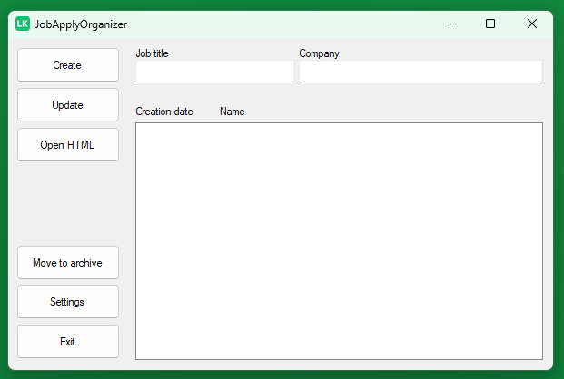

# JobApplyOrganizer
### This is a tool to organize and create job applications.

"- Att slå två flugor på en smäll."  
To both look for work while demonstrating skills that could be useful for an employer.

### First Sketch on project
[UML](https://github.com/KarlqvistLars/JobApplyOrganizer/blob/main/UML/UML_JobApplyOrganizer_20241003.pdf)  

 
# First version on UI design

